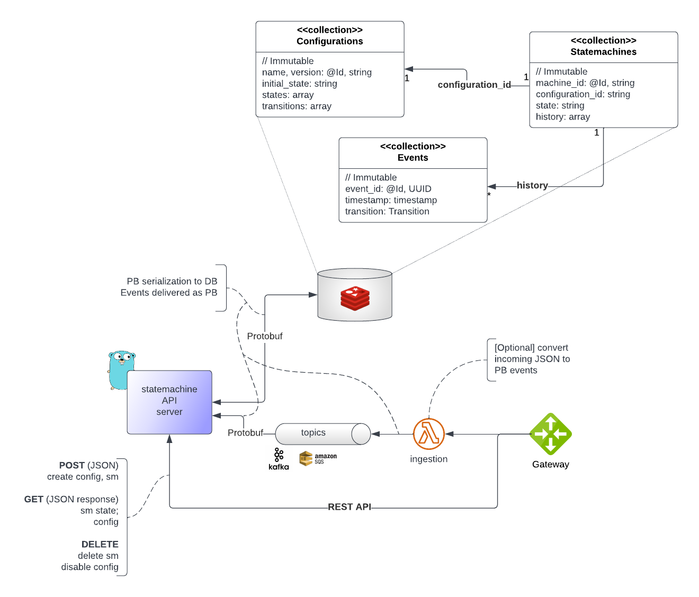

# go-statemachine

A basic implementation of a Finite State Machine in Go


[](https://github.com/massenz)
[](https://opensource.org/licenses/Apache-2.0)


### Copyright & Licensing

**The code is copyright (c) 2022 AlertAvert.com. All rights reserved**<br>
The code is released under the Apache 2.0 License, see `LICENSE` for details.

# Usage

`TODO`

# Design

The overall architecture is shown below:



*System Architecture*


# Build & Test

## Building Protocol Buffers definitions

All the base classes are defined in the `protos` folder and are used to (de)serialize state machines for storage in the database.

See [installation instructions](https://developers.google.com/protocol-buffers/docs/gotutorial) for compiling protobufs for Go; then run:

```shell
└─( mkdir "api"
└─( protoc --proto_path=protos/ \
           --go_out=api/ \
           --go_opt=paths=source_relative \
           protos/*.proto
```

The compiled PBs (`*.pb.go`) will be in the `api/` folder and can be imported with:

```shell
import 	"github.com/massenz/go-statemachine/api"

var config = api.Configuration{
    StartingState: "one",
    States:        []string{"S1", "S2", "S3"},
    Transitions: []*api.Transition{
        {From: "S1", To: "S2", Event: "go"},
        {From: "S2", To: "S3", Event: "land"},
    },
}

fsm := &api.FiniteStateMachine{}
fsm.Config = &config
fsm.State = config.StartingState
```
