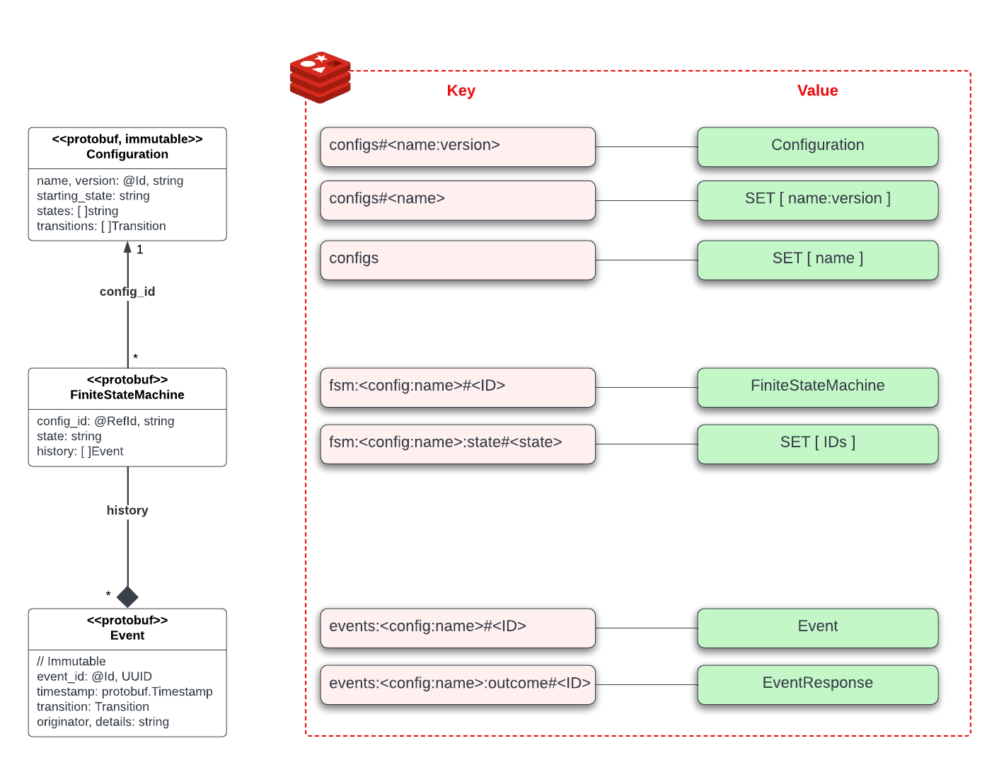

# go-statemachine

A basic implementation of a Finite State Machine in Go

[](https://opensource.org/licenses/Apache-2.0)

[](https://github.com/massenz/go-statemachine/actions/workflows/build.yml)
[](https://github.com/massenz/go-statemachine/actions/workflows/release.yaml)

### Copyright & Licensing

**The code is copyright (c) 2022 AlertAvert.com. All rights reserved**<br>
The code is released under the Apache 2.0 License, see `LICENSE` for details.

Fixes and additions are always welcome and warmly appreciated, please see the [Contributing](#contributing) section for some guidance.

# Overview

## Design

The overall architecture is shown below:


*System Architecture*

The gRPC API is described [here](#api), the Protobuf messages and gRPC methods are described in [their respective repository](https://github.com/massenz/statemachine-proto), and how [to run the server](#running-the-server) is further below.

The general design approach here optimizes for simplicity and efficiency: we would expect a single instance of the `sm-server` and a relatively low-scale Redis cluster to be able to handle millions of "statemachines" and several thousand events per second.

A "statemachine" is any business entity (uniquely identified by its `id`) whose `state` we need to track across `transitions`, where each transition is driven by an `event` - both states and events are simply described by (possibly, opaque) strings, to which the `sm-server` attaches no meaning (other than what a `configuration` defines).

A `configuration` is an immutable, versioned declaration of the `states` an FSM will subsequently traverse, along with the respective `transitions`, the latter defined as a tuple of:

```
{from, to, event}
```

Thus given the following `configuration`:

```
c1: {
  states: [s1, s2, s3],
  transitions: [ {s1, s2, evA}, {s1, s3, evB}],
  starting_state: s1
}
```
states that an FSM whose `config_id` is `c1`, will start its lifecycle in state `s1` and will end up in `s3` upon receiving `e1`:

```
e1: {event: "evB"}
```

See [Sending Events](#sending-events) below for details on how to encode an SQS Message to encode an `event`.

## Data Model

A StateMachine Server (`sm-server`) can track any number of different business entities, from a handful to tens to hundreds of different types of state machines: `users` or `orders` or `devices`, or whatever the actual underlying business needs require to keep track the state of.

Each "type" of business entity (e.g., `orders`) is defined by a `Configuration` that defines the `Transitions` the entity may go through, driven by external `Events`.

There can be up to millions (or more) entities of each type: each one of them is a `FiniteStateMachine` (`FSM`), which carries its current state, as well the `History` of `Events` that have driven its state.

For each `Event` (be it successful or not) we keep track of the `EventOutcome`.




*StateMachine Server Data Model*

In the next few sections we will describe the main entities in the data model, the [gRPC API](https://grpc.io/) to manipulate them is described [further below](#grpc-api).


### Configurations

A [`Configuration`](https://github.com/massenz/statemachine-proto/blob/golang/v1.1.0-beta-g1fc5dd8/api/statemachine.proto#L63-L82) has a distinctive `name` and is further uniquely identified by its `version` - combined, the two define a `config_id` which each FSM **must** reference upon creation.

Once created, a versioned configuration is **immutable** and cannot be changed: this is largely to prevent the introduction of bugs or causing FSMs to be stuck in an undefined State; if you need to update a Configuration, create a new version.

The `version` can really be anything, we recommend **not** using "semantic versioning" (as it would make little sense in this context) and instead use a monotonically increasing integer value (`v1`, `v2`, `v3`, etc.) or the scheme introduced by Kubernetes (`v1alpha`, `v1beta`, `v1`, ...).

As far as the server logic is concerned, we do not attach any meaning to the configuration version and it is entirely possible to create a `v1` *after* a `v2` has been created (provided there is not an already-created `v1`), alhtouhg this would be confusing and is discouraged.

A Configuration lists a set of `states` and `transitions` between states, which will drive the FSMs which are configured with it.

The server allows to retrieve all configurations names, and, for each name, all the versions; for each `{name, version}` tuple it is then possible to retrieve the full configuration data.


### State Machines

[`FiniteStateMachines` (FSMs)](https://github.com/massenz/statemachine-proto/blob/golang/v1.1.0-beta-g1fc5dd8/api/statemachine.proto#L96-L110) are the core entities managed by `sm-server` and represent business entities which can be modeled as being in a given state, and transitioning to different ones upon receiving `events`.

They are configured via a uniquely versioned `Configuration` (`config_id`) and additionally carry the `history` of `Events` that have been received by the FSM.

An FSM is uniquely identified in the system by their ID (see [the gRPC API](#grpc-api)) namespaced by the configuration `name` (but **not** the version): we assume that Configurations of the same 'name' refer to the same business entities, regardless of the version (which may reflect different stages of development; or even different versions of the FSMs themselves).

The FSM ID is **not** carried within the body (Protobuf) of the FSM itself.

> **NOTE**<br/>
> Currently no additional detail about the entity is stored in the server, as we assume there is another store of data which provides this information.
>
> However, this may change in future, and we plan to add the ability to store data within the FSM itself, either via an [`Any` Protocol Buffer](https://developers.google.com/protocol-buffers/docs/reference/csharp/class/google/protobuf/well-known-types/any) or an arbitrarily-encoded (e.g., JSON) string.
>
> For more on the `Any` "envelope pattern" see [this article](https://codetrips.com/2021/01/04/implement-the-envelope-wrapper-pattern-in-c-using-google-protocol-buffers/).


### Events

An [`Event`](https://github.com/massenz/statemachine-proto/blob/golang/v1.1.0-beta-g1fc5dd8/api/statemachine.proto#L40-L61) is, together with a `FiniteStateMachine`, the central entity of an `sm-server`: it will cause an FSM to `Transition` from one `state` to the next, if allowed by the `Configuration`.

An event is uniquely identified by its `event_id` and has a `timestamp` for when it was generated/sent - if not set by the client sending them to the server, they will be set when processing the event.

Optionally, an Event can have an `Originator` (for example, a URI identifying the system that generated the event) and `Details` that further describe it (this could be a JSON-encoded body, or a string-encoded Protocol Buffer): see an example in [the gRPC Client](clients/grpc_client.go).

Events have [outcomes](https://github.com/massenz/statemachine-proto/blob/golang/v1.1.0-beta-g1fc5dd8/api/statemachine.proto#L141-L164) which can be retrieved individually (see below in the [gRPC API](#grpc-api)): these describe whether the event caused a successful transition (with an `Ok` `code`) or there was an error (and if so, further `details`).

It is important to realize that events are processed **asynchronously** and thus their outcome (essentially, whether they resulted in a successful `Transition`) will never be returned after the invocation (and, rather obviously, cannot even be expected when Publishing the event to a topic): they should be retrieved at a later time and/or [error `notifications`](#sqs-notifications) should be consumed by a dedicated client.

The `event_id` can be used for such reconciliation: it is either provided by the client when sending events to `sm-server` or it is auto-generated by the server (as a random UUID) and returned in the `EventResponse`.

> **NOTE**
>
> Even though the `EventResponse` protocol buffer has an `outcome` field, this is always `null` when it is returned by an invocation of the `SendEvent` method: the server returns immediately to the caller, while the event is posted to an internal `channel` for processing in a goroutine.

## gRPC API

For a full description and documentation of the gRPC API, please see the [Protocol Buffer definition](https://github.com/massenz/statemachine-proto/blob/golang/v1.1.0-beta-g1fc5dd8/api/statemachine.proto).

The [gRPC API and examples](https://github.com/massenz/statemachine-proto) are described there too.

An example usage in Go is in the [gRPC Client](clients/grpc_client.go).


## Events Listener

We currently listen for events from an [AWS SQS queue](https://aws.amazon.com/sqs/) which is configured at server startup via the `-events` flag.

> **Note**
>
> The PubSub interface is abstracted in the [`EventsListener`](https://github.com/massenz/go-statemachine/blob/main/pubsub/types.go#L34-L39), and we are planning to add support for Kafka topics (see [Issue #66](https://github.com/massenz/go-statemachine/issues/66))

#### EventRequest

To send an Event to an FSM via an SQS Message we use the [following code](clients/sqs_client.go):

```
// This is the object you want to send across as Event's metadata.
order := NewOrderDetails(uuid.NewString(), "sqs-cust-1234", 99.99)

msg := &protos.EventRequest{
    Event: &protos.Event{
        // This is actually unnecessary; if no EventId is present, SM will
        // generate one automatically and if the client does not need to store
        // it somewhere else, it is safe to omit it.
        EventId:    uuid.NewString(),

        // This is also unnecessary, as SM will automatically generate a timestamp
        // if one is not already present.
        Timestamp:  timestamppb.Now(),

        Transition: &protos.Transition{Event: "backorder"},
        Originator: "New SQS Client with Details",

        // Here you convert the Event metadata to a string by, e.g., JSON-serializing it.
        Details:    order.String(),
    },

    // This is the unique ID for the entity you are sending the event to; MUST
    // match the `id` of an existing `statemachine` (see the REST API).
    // NOTE -- the ID is prefixed by the configuration name.
    Dest: "devices#6b5af0e8-9033-47e2-97db-337476f1402a",
}

_, err = queue.SendMessage(&sqs.SendMessageInput{
    // Here we serialize the Protobuf using text serialization.
    MessageBody: aws.String(proto.MarshalTextString(msg)),
    QueueUrl:    queueUrl.QueueUrl,
})
```

This will cause a `backorder` event to be sent to our FSM whose `id` matches the UUID in `Dest`; if there are errors (eg, the FSM does not exist, or the event is not allowed for the machine's configuration and current state) errors may be optionally sent to the SQS queue configured via the `-notifications` option (see [Running the Server](#running-the-server)): see the [`pubsub` code](pubsub/sqs_pub.go) code for details as to how we encode the error message as an SQS message.

See [`EventRequest` in `statemachine-proto`](https://github.com/massenz/statemachine-proto/blob/golang/v1.1.0-beta-g1fc5dd8/api/statemachine.proto#L86) for details on the event being sent.

See the example in the [`SQS Client`](clients/sqs_client.go).


#### SQS Notifications

Event processing outcomes are returned in [`EventResponse` protocol buffers](https://github.com/massenz/statemachine-proto/blob/golang/v1.1.0-beta-g1fc5dd8/api/statemachine.proto#L112), which are then serialized inside the `body` of the SQS message; to retrieve the actual Go struct, you can use code such as this (see [test code](pubsub/sqs_pub_test.go#L148) for actual working code):

```
// `res` is what AWS SQS Client will return to the Messages slice
var res *sqs.Message = getSqsMessage(getQueueName(notificationsQueue))
var receivedEvt protos.EventResponse
err := proto.UnmarshalText(*res.Body, &receivedEvt)
if err == nill {
    // you know what to do
}

receivedEvt.EventId --> is the ID of the Event that failed
if receivedEvt.Outcome.Code == protos.EventOutcome_InternalError {
    // whatever...
}
return fmt.Errorf("cannot process event to statemachine [%s]: %s,
    receivedEvt.Outcome.Dest, receivedEvt.Outcome.Details)

```

The possible error codes are (see the `.proto` definition for the up-to-date values):

```
  enum StatusCode {
    Ok = 0;
    GenericError = 1;
    EventNotAllowed = 2;
    FsmNotFound = 3;
    TransitionNotAllowed = 4;
    InternalError = 5;
    MissingDestination = 6;
    ConfigurationNotFound = 7;
  }
```


# Build & Run

## Prerequisites

**Ginkgo testing framework**<br/>
We are using [Ginkgo](https://onsi.github.io/ginkgo/) at **v1** (`v1.16.5`).

To install the CLI run this:

    go install github.com/onsi/ginkgo/ginkgo

> **Beware** Gingko now is at `v2` and will install that one by default if you follow the instruction on the site: use instead the command above and run `go mod tidy` before running the tests/builds to download packages<br/>
> (see [this issue](https://github.com/onsi/ginkgo/issues/945) for more details)


**Protocol Buffers definitions**<br/>
They are kept in the [statemachine-proto](https://github.com/massenz/statemachine-proto) repository; nothing specific is needed to use them; however, if you want to review the messages and services definitions, you can see them there.

**Supporting services**<br/>
The `sm-server` requires a running [Redis](#) server and [AWS Simple Queue Service (SQS)](#); they can be both run locally in containers: see [the Docker Compose](docker/compose.yaml) configuration and [Container Build & Run](#container-build--run).


## Build & Test

The `sm-server` is built with

    make build

and the tests are run with `make test`.

The binary is in `build/bin` and to see all the available configuration options use:

        build/bin/sm-server -h

Prior to running the server, if you want to use the local running stack, use:

        make services && make queues

To create the necessary SQS Queues in AWS, please see the `aws` CLI command in `Makefile`, `queues` recipe, using a valid profile (in `AWS_PROFILE`) and Region (`AWS_REGION`), with the required IAM permissions.

## Running the Server

The `sm-server` accepts a number of configuration options (some of them are **required**); please use the `-help` option to view the most up-to-date definitions.

```
└─( build/bin/sm-server -help
```

The easiest way is to run it [as a container](#container-build--run) (see also **Supporting Services** in [Prerequisites]](#prerequisites)):

```
make container && docker run --rm -d -p 7398:7398 --name sm-server \
    --env AWS_ENDPOINT=http://awslocal:4566 --env TIMEOUT=200ms \
    --env DEBUG=-debug --network sm_sm-net  \
      massenz/statemachine:$(./get-tag)
```

(add `-p 7398:7398` if you want to access the HTTP API, but **please note this is deprecated and will soon be removed**).

If you want to connect it to an actual AWS account, configure your AWS credentials appropriately, and use `AWS_PROFILE` if not using the `default` account:

`AWS_PROFILE=my-profile AWS_REGION=us-west-2 build/bin/sm-server -debug -events events`

will try and connect to an SQS queue named `events` in the `us-west-2` region.

For an example of how to send events either to an SQS queue or via a gRPC call, see example clients in the [`clients`](clients) folder.

Logs are sent to `stdout` by default, but this can be changed using the [`slf4go`](https://github.com/massenz/slf4go) configuration methods.


## Container Build & Run

Running the server inside a container is much preferable; to build the container use:

        make container

and then:

        docker run --rm -d -p 7399:7399 --name sm-server \
            --env AWS_ENDPOINT=http://awslocal:4566 \
            --env DEBUG=-debug --network docker_sm-net  \
            massenz/statemachine:$(./get-tag)

These are the environment variables whose values can be modified as necessary (see also the `Dockerfile`):

```
ENV AWS_REGION=us-west-2
ENV AWS_PROFILE=sm-bot

# Sensible defaults for the server
# See entrypoint.sh
ENV SERVER_PORT=7399
ENV EVENTS_Q=events
ENV ERRORS_Q=notifications
ENV REDIS=redis
ENV REDIS_PORT=6379
ENV DEBUG=""

# Optional settings for the server
ENV ACKS="-acks acks"
ENV CLUSTER="-cluster"
ENV NOTIFY_ERRORS_ONLY="-notify-errors-only"
```

Additionally, a valid `credentials` file will need to be mounted (using the `-v` flag) in the container if connecting to AWS (instead of LocalStack):

        -v /full/path/to/.aws/credentials:/home/sm-bot/.aws/credentials

where the `[profile]` matches the value in `AWS_PROFILE`.


# Contributing

Please follow the Go Style enshrined in `go fmt` before submitting PRs, refer to actual [Issues](https://github.com/massenz/go-statemachine/issues), and provide sufficient testing (ideally, ensuring code coverage is better than 70%).

We prefer you submit a PR directly from cloning this repository and creating a feature branch, rather than from a fork.

If you are relatively new to this topic, there are a few issues labeled as [`Good First Issue`](https://github.com/massenz/go-statemachine/issues?q=is%3Aissue+is%3Aopen+label%3A%22good+first+issue%22), those are a good starting point.

Please, always **squash and rebase** on `main`, we try to keep a relatively clean and linear commit history, and each PR should just be **one** commit with a descriptive title (see below).

## Detailed Requirements to submit a PR

1. make sure the Issue you are trying to address is referenced appropriately in the PR Title:

```
[#34] Implements gRPC API to update/retrieve Event outcomes
```

2. prior to submitting the PR, make sure that the code is properly formatted and tested:

```
make fmt && make test
```

3. if this is a breaking change, or a significant change to the API or behavior, please update the [README](README.md) accordingly.

## Guidelines to be A Good Contributor

Provide enough detail of your changes in the PR comments and make it easy for reviewers:

* if your code contains several lines of "commented out dead code" make sure that you clearly explain why this is so with a `TODO` and an explanation of why are you leaving dead code around (remember, we are using `git` here, there is no such thing "in case we forget" - `git` **never** forgets)
* try and be consistent with the rest of the code base and, specifically, the code around the changes you are implementing
* be consistent with the `import` format and sequence: if in doubt, again, look at the existing code and be **consistent**
* make sure the new code is **covered by unit tests**, use `make coverage` to check coverage % and view lines covered in the browser
* try and adopt "The Boyscout Rule": leave the campsite cleaner than you found it -- in other words, adding tests, fixing typos, fixing **minor** issues is always **greatly** appreciated
* conversely, try and keep the PR focused on one topic/issue/change, and one only: we'd rather review 2 PRs, than try and disentangle the two unrelated issues you're trying to address

If in doubt, look at the existing code, or feel free to ask in the PR's comments - we don't bite :-)
